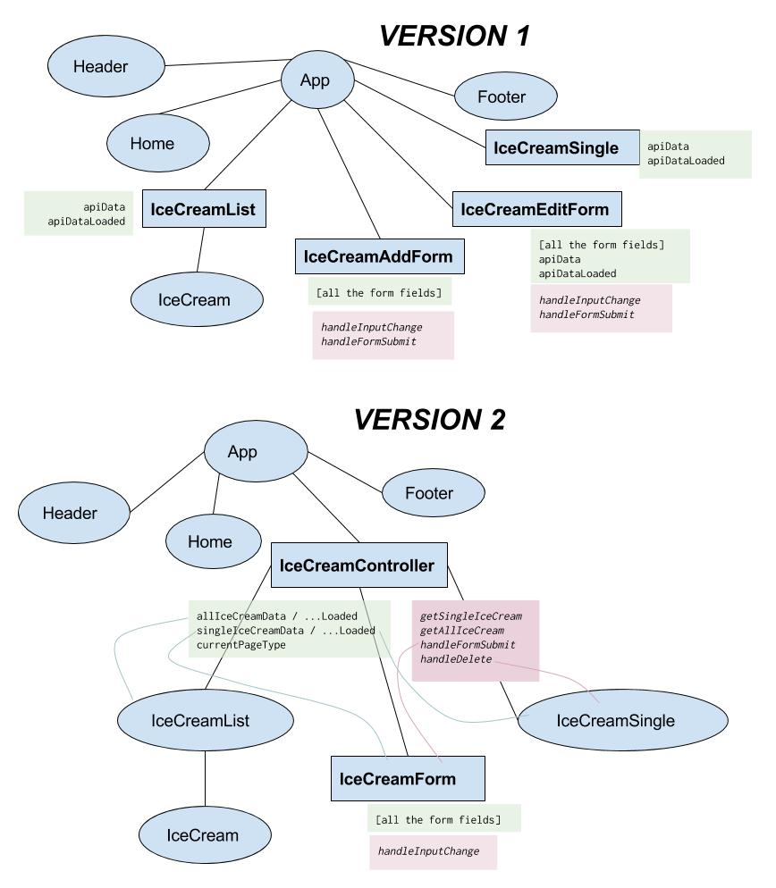

# Connecting React and Express!

### Learning Objectives

- Build an app about ice cream!
- Practice setting up a React frontend with an Express backend
- Implement full CRUD functionality into our React app
- Profit??? 🍦

### IN THIS REPOSITORY ARE THE FOLLOWING THINGS!

- This beautiful readme ✨
- An ice cream API, built with Express (`icecream-app-begin`)
- That same ice cream API, this time with a React frontend (`icecream-app-final`)

### WE'RE GONNA DO SOME THINGS!

- Add a React app to serve as the frontend for our Express app
- Create, edit, and delete ice cream records from the database
- Use React Router to handle the different components that are rendered
- Have a really excellent time looking at ice cream

# Step 0: Setting up your environment

- We're using **`yarn`**, not `npm`, for this project, so make sure you have `yarn` installed globally. `npm install -g yarn`
- Within the Express app `icecream-app-begin` run `yarn install` (NOT `npm install!!`)
    - Sidebar: It's best during a project to only use one or the other. This project was initialized using `yarn`, so we need to run `yarn install` to install the dependencies.
- Create a database `icecream_dev` in psql
- Run the migration and the seed file (`icecream.sql`) using `psql -d icecream_dev -f`.
- In `server.js` change the port from `3000` to `3001`.
- Start the Express app using `yarn dev`!

# Step 0.5: Setting up the React app

We want our Express app to serve our React app. While it's possible to have the react app and the express app be totally separate, it's neater and easier to control to put them in the same place.

- Run `create-react-app client`. It's customary to name the frontend section of your app `client`.
- cd into `client` and run `yarn add react-router-dom`, we're going to need to use it in a bit.
- In `client/package.json`, add this line at the bottom: `"proxy": "http://localhost:3001"`. This allows us to make requests from the frontend to the backend, since they're running on different ports right now. Eventually, we will have the Express app serving the React app, but we want the handy React developer server and its "hot reloading".
- Run `yarn start` to start the react app.

Now we should have an Express app and a React app running at the same time!

# Step 1: Setting up our initial components

- Within the React app, create a `src/components` folder. Then, create the following components (right now, we're just going to work on `Header` and `Footer`:
    - Header
    - Footer
    - IceCreamController
    - IceCreamList
    - IceCream
    - IceCreamSingle
    - IceCreamForm
    - Home

In our `App.js`, we want to get rid of all the React boilerplate. We're going to use Router in this app, so the first thing we need to do that is just wrap the entire app in `<Router>`.

```jsx
class App extends Component {
  render() {
    return (
      <Router>
        <div className="App">
          <Header />
          
          <Footer />
        </div>
      </Router>
    );
  }
}
```

We also need to set up the links in our `Header` component:

```jsx
      <nav>
        <ul>
          <li><Link to='/'>Home</Link></li>
          <li><Link to='/ice-cream'>Ice Cream</Link></li>
        </ul>
      </nav>
```

And create our `Footer` component.

There's also some css to put into your `App.css` [here](https://git.generalassemb.ly/raw/gist/jlr7245/2bbb3cf417784c9ced00c0621d38f281/raw/8cc3759e40e13be5df433e9b10b846e7f17c0b6f/App.css).

At this point, this is what our three components look like:

<details>
<summary>App.js</summary>

```jsx
import React, { Component } from 'react';
import './App.css';

import {
  BrowserRouter as Router,
  Route
} from 'react-router-dom'

import Header from './components/Header';
import Footer from './components/Footer';


class App extends Component {
  render() {
    return (
      <Router>
        <div className="App">
          <Header />
            <div className="container">

            </div>
          <Footer />
        </div>
      </Router>
    );
  }
}

export default App;

```
</details>

<details>
<summary>Header</summary>

```jsx
import React from 'react';

import { Link } from 'react-router-dom';

const Header = () => {
  return (
    <header>
      <div className='logo'>
        Thundercats Ice Cream!
      </div>
      <nav>
        <ul>
          <li><Link to='/'>Home</Link></li>
          <li><Link to='/ice-cream'>Ice Cream</Link></li>
        </ul>
      </nav>
    </header>
  )
}

export default Header;
```

</details>

<details>
<summary>Footer.jsx</summary>

```jsx
import React from 'react';

const Footer = () => {
  return (
    <footer>
      Made with ❤️ by WDI Thundercats
    </footer>
  )
}

export default Footer;
```

</details>

## 🚀 LAB!

Get your `icecream-app-begin` app to look like the one we've been working on!

# Step 2: Create our `Home`, `IceCreamController`, `IceCreamList`, and `IceCream` components.

### `Home` component

Our `Home` page is going to be pretty basic, just a stateless functional component:

```jsx

import React from 'react';

const Home = () => {
  return (
    <div className="home">
      <h1>Ice Cream</h1>
      <h3>It is the best dessert!</h3>
    </div>
  )
}

export default Home;

```

Then, in between the Header and Footer in our App component's `render` method, we need to add the applicable route:

```jsx
<Route exact path='/' component={Home} />
```

### A New React Pattern

Next, we should create the `IceCreamController` component. Instead of making a bunch of separate, independent components with unrelated state, we're going to make a parent `controller` component and use that to decide what part of our app should render.

_Real talk: I was chugging along through this lecture when I realized that hey, actually, we could do this in a way that's **so much better**, and I realized that I had to redo a lot of things I'd done beforehand. I wanted to keep the commit history nice and neat, but the payoff of having a better architecture is worth it._



### `IceCreamController` Component

All of the API calls will be made from the `IceCreamController` component, which will be responsible for rendering the other components based on what the current page is. Let's quickly set this up with the `IceCreamList` component.

First, let's scaffold out the two relevant components:

- `IceCreamController` will be a stateful component.
- `IceCreamList` will be a stateless functional component.

`IceCreamController` is going to decide which type of component to render. Remember this from the pizza app?

```jsx
  decideWhichToRender() {
    if (!this.state.dataLoaded) {
      return <p>Loading...</p>
    }
    switch (this.state.currentPage) {
      case 'home':
        return <Home getSinglePizza={this.getSinglePizza} allPizzas={this.state.allPizzas} />;
        break;
      case 'show':
        return <Show pizza={this.state.singlePizzaData} changePage={this.changePage} deletePizza={this.deletePizza} />;
        break;
      case 'edit':
        return <Form isAdd={false} pizza={this.state.singlePizzaData} pizzaSubmit={this.pizzaSubmit} />;
        break;
      case 'new':
        return <Form isAdd={true} pizzaSubmit={this.pizzaSubmit} />;
        break;
      default:
        return <Home getSinglePizza={this.getSinglePizza} />;
        break;
    }
  }
```

We're going to have a function that looks very similar to that in the `IceCreamController`. And we're going to pass the `currentPage` value in from the router:

```jsx
<Route exact path="/ice-cream"
    render={() => <IceCreamController currentPage="index" />}
/>
<Route exact path="/ice-cream/:id"
    render={props => (<IceCreamController
    currentPage="show" currentId={props.match.params.id} />)}
/>
```

(We don't need the `/:id` route yet, it's just in there in order to demonstrate how we're passing in the current page.)

Then, in the `IceCreamController`, we're going to need to do the following things:
- Make sure the component's state is set with the type of page it currently is
- When the component loads, if it's an index page,
    - Make an API call to get all the icecreams
    - Set that data in state
    - And pass it into an `IceCreamList` type of component.

We're passing the current page in as a prop on the `IceCreamController`, so we can reference it in the constructor like this:

```jsx
class IceCreamController extends Component {
  constructor(props) {
    super(props);
    this.state = {
      currentPage: props.currentPage,
      dataLoaded: false,
      allIceCreams: null,
    }
  }

  render() {
    return (
      <h1>Here is the controller! We are on the {this.state.currentPage} page.</h1>
    )
  }
}
```

Notice that we have to pass the props into the constructor in order to set state with them.

Now, if it's an index page, we need to get all the icecreams on page load. Sounds like this to me:

```jsx
componentDidMount() {
  if (this.state.currentPage === 'index') {
    fetch('/api/icecream')
      .then(res => res.json())
      .then(res => {
        this.setState({
          allIceCreams: res.data.icecreams,
          dataLoaded: true,
        });
      }).catch(err => console.log(err));
  } 
}
```


Then, of course, we need our `decideWhichToRender` function:

```jsx
decideWhichToRender() {
  switch (this.state.currentPage) {
    case 'index':
      return <IceCreamList allIceCreams={this.state.allIceCreams} />;
      break;
    default:
      return <Redirect push to="/ice-cream" />;
      break;
  }
}
```

And last but not least, our `render` method:

```jsx
  render() {
    return (
      <div className="container">
        {(this.state.dataLoaded) ? this.decideWhichToRender() : <p>Loading...</p>}
      </div>
    )
  }
```

<details>
  <summary><code>IceCreamController</code></summary>

```jsx
class IceCreamController extends Component {
  constructor(props) {
    super(props);
    this.state = {
      currentPage: props.currentPage,
      dataLoaded: false,
      allIceCreams: null,
    }
  }

  componentDidMount() {
    if (this.state.currentPage === 'index') {
      fetch('/api/icecream')
        .then(res => res.json())
        .then(res => {
          this.setState({
            allIceCreams: res.data.icecreams,
            dataLoaded: true,
          });
        }).catch(err => console.log(err));
    } 
  }

  decideWhichToRender() {
    switch (this.state.currentPage) {
      case 'index':
        return <IceCreamList allIceCreams={this.state.allIceCreams} />;
        break;
      default:
        return <Redirect push to="/ice-cream" />;
        break;
    }
  }

  render() {
    return (
      <div className="container">
        {(this.state.dataLoaded) ? this.decideWhichToRender() : <p>Loading...</p>}
      </div>
    )
  }
}
```
</details>

### `IceCreamList` component

The `IceCreamList` component just needs to be a stateless functional component that looks something like this:

```jsx
import React from 'react';

import IceCream from './IceCream';

const IceCreamList = (props) => {
  return (
    <div className="icecream-list">
      {props.allIceCreams.map(icecream => {
        return <IceCream key={icecream.id} icecream={icecream} />
      })}
    </div>
  );
};

export default IceCreamList;

```

We're taking all the API data and mapping over it to return individual `IceCream` components.

### `IceCream` component

This is another stateless functional component:

```jsx
import React from 'react';

import { Link } from 'react-router-dom';

const IceCream = (props) => {
  return (
    <div className="ic-inlist">
      
      <h2>{props.icecream.flavor}</h2>
      <p>Rating: {props.icecream.rating}</p>
      <Link to={`/ice-cream/${props.icecream.id}`}>See More</Link>
    </div>
  )
}

export default IceCream;
```

We're including `Link` from `react-router-dom` so that we can link to the individual ice cream pages. That doesn't work yet -- we're going to make it work next.


## 🚀 LAB!

Get your `icecream-app-begin` app to look like the one we've been working on!

Refer back to the code in the lecture notes if you get stuck 😉

# Step 3: `IceCreamSingle` Component

This is the component that will show up when we go to `/ice-cream/:id` -- the page for a single ice cream.

### Updating the `IceCreamController`

We already wrote the route for a single ice cream. It looks like this in `App.js`:

```jsx
<Route exact path="/ice-cream/:id"
  render={props => (<IceCreamController
    currentPage="show" currentId={props.match.params.id} />)}
/>
```

So we're passing in the type of page it should be to the `IceCreamController` and also the id from the route. This gives us another thing to set up initially in the state:

```jsx
constructor(props) {
  super(props);
  this.state = {
    currentPage: props.currentPage,
    currentId: props.currentId || null,
    dataLoaded: false,
    allIceCreams: null,
    currentIceCream: null,
  }
}
```

We only want data about one particular ice cream here, so we're going to go ahead and set up the api call for it in `componentDidMount`:

```jsx
componentDidMount() {
  if (this.state.currentPage === 'index') {
    // api call for all icecream goes here
  } else if (this.state.currentPage === 'show') {
    fetch(`/api/icecream/${this.state.currentId}`)
      .then(res => res.json())
      .then(res => {
        this.setState({
          currentIceCream: res.data.icecream,
          dataLoaded: true,
        })
      }).catch(err => console.log(err));
  }
}
```

Then, we need to add a case for it in our `decideWhichToRender` switch statement:

```jsx
decideWhichToRender() {
  switch (this.state.currentPage) {
    case 'index':
      return <IceCreamList allIceCreams={this.state.allIceCreams} />;
      break;
    case 'show':
      return <IceCreamSingle icecream={this.state.currentIceCream} />;
      break;
    default:
      return <Redirect push to="/ice-cream" />;
      break;
  }
}
```

So, when the `IceCreamController` component mounts, if it's a `show` route, we're getting the data that matches the ID in the route, and sending it to the `IceCreamSingle component.

<details>
  <summary><code>IceCreamController</code></summary>

```jsx
class IceCreamController extends Component {
  constructor(props) {
    super(props);
    this.state = {
      currentPage: props.currentPage,
      currentId: props.currentId || null,
      dataLoaded: false,
      allIceCreams: null,
      currentIceCream: null,
    }
  }

  componentDidMount() {
    if (this.state.currentPage === 'index') {
      fetch('/api/icecream')
        .then(res => res.json())
        .then(res => {
          this.setState({
            allIceCreams: res.data.icecreams,
            dataLoaded: true,
          });
        }).catch(err => console.log(err));
    } else if (this.state.currentPage === 'show') {
      fetch(`/api/icecream/${this.state.currentId}`)
        .then(res => res.json())
        .then(res => {
          this.setState({
            currentIceCream: res.data.icecream,
            dataLoaded: true,
          })
        }).catch(err => console.log(err));
    }
  }

  decideWhichToRender() {
    switch (this.state.currentPage) {
      case 'index':
        return <IceCreamList allIceCreams={this.state.allIceCreams} />;
        break;
      default:
        return <Redirect push to="/ice-cream" />;
        break;
    }
  }

  render() {
    return (
      <div className="container">
        {(this.state.dataLoaded) ? this.decideWhichToRender() : <p>Loading...</p>}
      </div>
    )
  }
}
```
</details>

### The `IceCreamSingle` component

This is going to be a stateless functional component, using the `icecream` prop that's been passed into it. It looks like this:

```jsx
import React, { Component } from 'react';

import { Link } from 'react-router-dom';

const IceCreamSingle = (props) => {
  return (
    <div className="icecream-single">
      <div className="inner">
        <div className="img">
          
        </div>
        <div className="info">
          <h4 className="brand">{props.icecream.brand}</h4>
          <h1>{props.icecream.flavor}</h1>
          <p>{props.icecream.description}</p>
          <div className="links">
            <span className="rating">Rating: {props.icecream.rating}</span>
          </div>
        </div>
      </div>
    </div>
  )
}

export default IceCreamSingle;
```

## 🚀 LAB!

Get your `icecream-app-begin` app to look like the one we've been working on!

Refer back to the code in the lecture notes if you get stuck 😉

# Step 4: Adding the form to create a new ice cream

Next, we need to have the form render. We're going to do this from the `IceCreamController` component as well, since in the next step we're going to modify the form so that it's appropriate for edit as well.

Since we want to use controlled inputs to render the form, we need to make the form a stateful component.

```jsx
import React, { Component } from 'react';

class IceCreamForm extends Component {
  constructor() {
    super();
    this.state = {
      flavor: '',
      description: '',
      rating: '',
      url: '',
      brand: '',
    }
  }

  render() {
    return (
      <div>Form goes here!</div>
    )
  }
}

export default IceCreamForm;
```

We'll also need to write our `handleInputChange` function. This one comes directly from the React docs.

```jsx
handleInputChange(e) {
  const name = e.target.name;
  const val = e.target.value;
  this.setState({
    [name]: val,
  });
}

```

(Don't forget to bind it!)

And, of course, we need to create all the appropriate inputs.

<details>
<summary><code>IceCreamForm</code></summary>

```jsx
import React, { Component } from 'react';

class IceCreamForm extends Component {
  constructor() {
    super();
    this.state = {
      flavor: '',
      description: '',
      rating: '',
      url: '',
      brand: '',
    }
    this.handleInputChange = this.handleInputChange.bind(this);
  }

  handleInputChange(e) {
    const name = e.target.name;
    const val = e.target.value;
    this.setState({
      [name]: val,
    });
  }

  render() {
    return (
      <div className="add">
      <form className="addform" {/* see below for the onSubmit */}>
        <input type="text" name="flavor" placeholder="Flavor" value={this.state.flavor} onChange={this.handleInputChange} />
        <input type="text" name="description" placeholder="Description" value={this.state.description} onChange={this.handleInputChange} />
        <input type="text" name="rating" placeholder="rating" value={this.state.rating} onChange={this.handleInputChange} />
        <input type="text" name="url" placeholder="url" value={this.state.url} onChange={this.handleInputChange} />
        <input type="text" name="brand" placeholder="brand" value={this.state.brand} onChange={this.handleInputChange} />
        <input type="submit" value='Add it!' />
      </form>
      </div>
    );
  }
}

export default IceCreamForm;
```
</details>

### Setting up the route in `App`

In the app, we need to create the new route for the `IceCreamForm`:

```jsx
<Route exact path="/new" render={() => (<IceCreamController currentPage="new" />)} />
```

### Adding a link to `Header`

In the `Header` component, we can go ahead and add this after the link to the `/ice-cream` route:

```jsx
<li><Link to="/new">Add Another</Link></li>
```

### Modifying `IceCreamController`

The `IceCreamController` now needs to do three things:
- Handle the new type of page
- Handle the submission of the ice cream form
- Redirect to the new ice cream's show page once the data is back

There's no data needed from the database when the `new` form loads, so we can do something like this in our `componentDidMount`:

```jsx
// other conditions up here....
} else if (this.state.currentPage === 'new') {
  this.setState({
    dataLoaded: true,
  })
}
```

And we'll add a `new` case in `decideWhichToRender`:

```jsx
case 'new':
  return <IceCreamForm iceCreamSubmit={this.iceCreamSubmit} />;
  break;
```

Note we're passing a method `this.iceCreamSubmit` into the `IceCreamForm`. That's the function that'll add the ice cream to the database and also set up to redirect to its show page. That function will look like this:

```jsx
iceCreamSubmit(event, data) {
  event.preventDefault();
  fetch(`/api/icecream/`, {
    method: 'POST',
    headers: {
      'Content-Type': 'application/json',
    },
    body: JSON.stringify(data),
  }).then(res => res.json())
    .then(res => {
      this.setState({
        fireRedirect: true,
        redirectPath: `/ice-cream/${res.data.icecream.id}`,
      })
    });
}
```

Woah! What is that `fireRedirect` thing? Well, we don't want to be stuck on the `new` form once the data has been submitted, right? So we need to redirect to the ice cream's new page. The data that we get back from the database when we create an ice cream includes the new ice cream's ID, so we're saying that the path we need to redirect to is `/ice-cream/[new icecream id]`. We'll use that at the end of the `IceCreamController`'s render method:

```jsx
{this.state.fireRedirect && <Redirect push to={this.state.redirectPath} />}
```

<details>
  <summary><code>IceCreamController</code></summary>

  ```jsx
import React, { Component } from 'react';

import IceCreamList from './IceCreamList';
import IceCreamSingle from './IceCreamSingle';
import IceCreamForm from './IceCreamForm';

import { Link, Redirect } from 'react-router-dom'

class IceCreamController extends Component {
  constructor(props) {
    super(props);
    this.state = {
      currentPage: props.currentPage,
      currentId: props.currentId || null,
      dataLoaded: false,
      allIceCreams: null,
      currentIceCream: null,
      fireRedirect: false,
      redirectPath: null,
    }
    this.iceCreamSubmit = this.iceCreamSubmit.bind(this);
  }

  componentDidMount() {
    if (this.state.currentPage === 'index') {
      fetch('/api/icecream')
        .then(res => res.json())
        .then(res => {
          this.setState({
            allIceCreams: res.data.icecreams,
            dataLoaded: true,
          });
        }).catch(err => console.log(err));
    } else if (this.state.currentPage === 'show') {
      fetch(`/api/icecream/${this.state.currentId}`)
        .then(res => res.json())
        .then(res => {
          this.setState({
            currentIceCream: res.data.icecream,
            dataLoaded: true,
          })
        }).catch(err => console.log(err));
    } else if (this.state.currentPage === 'new') {
      this.setState({
        dataLoaded: true,
      })
    }
  }

  iceCreamSubmit(event, data) {
    event.preventDefault();
    fetch(`/api/icecream`, {
      method: method,
      headers: {
        'Content-Type': 'application/json',
      },
      body: JSON.stringify(data),
    }).then(res => res.json())
      .then(res => {
        this.setState({
          fireRedirect: true,
          redirectPath: `/ice-cream/${res.data.icecream.id}`,
        })
      });
  }


  decideWhichToRender() {
    switch (this.state.currentPage) {
      case 'index':
        return <IceCreamList allIceCreams={this.state.allIceCreams} />;
        break;
      case 'show':
        return <IceCreamSingle icecream={this.state.currentIceCream} />;
        break;
      case 'new':
        return <IceCreamForm iceCreamSubmit={this.iceCreamSubmit} />;
        break;
      default:
        return <Redirect push to="/ice-cream" />;
        break;
    }
  }

  render() {
    return (
      <div className="container">
        {(this.state.dataLoaded) ? this.decideWhichToRender() : <p>Loading...</p>}
        {this.state.fireRedirect && <Redirect push to={this.state.redirectPath} />}
      </div>
    )
  }
}

export default IceCreamController;

  ```

</details>

### Adding the submit to `IceCreamForm`

Then, last but not least, we need to add the `onSubmit` method to the `IceCreamForm` component.

```jsx
// stuff up here...
<form className="addform" onSubmit={e => this.props.iceCreamSubmit(e, this.state)}>
{/* stuff down here... */}
</form>
```

Since we have everything we need in state, we don't need to individually pull out values and pass them in. We can just pass in the whole object.

## 🚀 LAB!

Get your `icecream-app-begin` app to look like the one we've been working on!

Refer back to the code in the lecture notes if you get stuck 😉

# Step (I forget what number step I'm on): Adding edit functionality to our form!

Our form right now works for adding an ice cream. Let's make it work for editing one as well!

In order to have a good edit form, we need to prepopulate the form with the previous data. Which means:

- When we go to an edit page (`/ice-cream/edit/:id`),
- we need to grab the data for the ice cream at that particular id
- and pass it into the form component
- where it will be used to fill in the input fields that are already there.

Let's get to it.

### Route in `App`!

```jsx
<Route exact path="/ice-cream/edit/:id"
  render={props => (<IceCreamController
    currentPage="edit" currentId={props.match.params.id} />)}
/>
```

### Link from the `IceCreamSingle`!

We want the edit form to be available from `IceCreamSingle`. So let's set that up:

```jsx
{/* underneath the rating span */}
<Link to={`/ice-cream/edit/${props.icecream.id}`}>Edit</Link>
```

### Handling the data fetch in `IceCreamController`'s `componentDidMount`!

This one's easy. All we need to do, right, is add to our condition for the `show` page, so that when we go to an `edit` page, we make a similar API call.

```js
// other stuff here
} else if (this.state.currentPage === 'show' || this.state.currentPage === 'edit') {
  fetch(`/api/icecream/${this.state.currentId}`)
    .then(res => res.json())
    .then(res => {
      this.setState({
        currentIceCream: res.data.icecream,
        dataLoaded: true,
      })
    }).catch(err => console.log(err));
} // last condition here
```

### Adding to our switch case!

We're gonna be adding in a couple of new things here. The form component should know, right, whether or not it's an add form or an edit form, so it can do slightly different things. So we have pass in a `isAdd` boolean, so we can do some conditional rendering on the form.

And, in our `edit` form, we'll pass in the data about the ice cream.

```jsx
case 'new':
  return <IceCreamForm isAdd={true} iceCreamSubmit={this.iceCreamSubmit} />;
  break;
case 'edit':
  return <IceCreamForm isAdd={false} iceCreamSubmit={this.iceCreamSubmit} icecream={this.state.currentIceCream} />
  break;
```

<details>
<summary><code>IceCreamController</code></summary>

```jsx
import React, { Component } from 'react';

import IceCreamList from './IceCreamList';
import IceCreamSingle from './IceCreamSingle';
import IceCreamForm from './IceCreamForm';

import { Link, Redirect } from 'react-router-dom'

class IceCreamController extends Component {
  constructor(props) {
    super(props);
    this.state = {
      currentPage: props.currentPage,
      currentId: props.currentId || null,
      dataLoaded: false,
      allIceCreams: null,
      currentIceCream: null,
      fireRedirect: false,
      redirectPath: null,
    }
    this.iceCreamSubmit = this.iceCreamSubmit.bind(this);
  }

  componentDidMount() {
    if (this.state.currentPage === 'index') {
      fetch('/api/icecream')
        .then(res => res.json())
        .then(res => {
          this.setState({
            allIceCreams: res.data.icecreams,
            dataLoaded: true,
          });
        }).catch(err => console.log(err));
    } else if (this.state.currentPage === 'show' || this.state.currentPage === 'edit') {
      fetch(`/api/icecream/${this.state.currentId}`)
        .then(res => res.json())
        .then(res => {
          this.setState({
            currentIceCream: res.data.icecream,
            dataLoaded: true,
          })
        }).catch(err => console.log(err));
    } else if (this.state.currentPage === 'new') {
      this.setState({
        dataLoaded: true,
      })
    }
  }

  iceCreamSubmit(method, event, data, id) {
    event.preventDefault();
    fetch(`/api/icecream/${id || ''}`, {
      method: method,
      headers: {
        'Content-Type': 'application/json',
      },
      body: JSON.stringify(data),
    }).then(res => res.json())
      .then(res => {
        this.setState({
          fireRedirect: true,
          redirectPath: `/ice-cream/${res.data.icecream.id}`,
        })
      });
  }

  decideWhichToRender() {
    switch (this.state.currentPage) {
      case 'index':
        return <IceCreamList allIceCreams={this.state.allIceCreams} />;
        break;
      case 'show':
        return <IceCreamSingle icecream={this.state.currentIceCream} />;
        break;
      case 'new':
        return <IceCreamForm isAdd={true} iceCreamSubmit={this.iceCreamSubmit} />;
        break;
      case 'edit':
        return <IceCreamForm isAdd={false} iceCreamSubmit={this.iceCreamSubmit} icecream={this.state.currentIceCream} />
        break;
      default:
        return <Redirect push to="/ice-cream" />;
        break;
    }
  }

  render() {
    return (
      <div className="container">
        {(this.state.dataLoaded) ? this.decideWhichToRender() : <p>Loading...</p>}
        {this.state.fireRedirect && <Redirect push to={this.state.redirectPath} />}
      </div>
    )
  }
}

export default IceCreamController;

```

</details>

### Updating our submit method!

Notice also we're using the same `iceCreamSubmit` method, even though one is a PUT request and one is a POST request.  There are only a couple differences between the necessary PUT request and the POST request:

- The method itself
- Whether or not it's a request to `/api/icecream` or `/api/icecream/:id`

We can handle both of these in the `iceCreamSubmit` method itself:

```js
iceCreamSubmit(method, event, data, id) {
  event.preventDefault();
  fetch(`/api/icecream/${id || ''}`, {
    method: method,
    headers: {
      'Content-Type': 'application/json',
    },
    body: JSON.stringify(data),
  }).then(res => res.json())
    .then(res => {
      this.setState({
        fireRedirect: true,
        redirectPath: `/ice-cream/${res.data.icecream.id}`,
      })
    });
}
```

We don't even need to change any of the redirect stuff, we just need to change the URL and the method.

We do, however, need to make some changes to the `IceCreamForm`:

```jsx
import React, { Component } from 'react';

class IceCreamForm extends Component {
  constructor(props) {
    super(props);
    this.state = {
      flavor: props.icecream ? props.icecream.flavor : '',
      description: props.icecream ? props.icecream.description : '',
      rating: props.icecream ? props.icecream.rating : '',
      url: props.icecream ? props.icecream.url : '',
      brand: props.icecream ? props.icecream.brand : '',
    };
    this.handleInputChange = this.handleInputChange.bind(this);
  }

  handleInputChange(e) {
    const name = e.target.name;
    const val = e.target.value;
    this.setState({
      [name]: val,
    });
  }

  render() {
    return (
      <div className="add">
      <form className={this.props.isAdd ? 'addform' : 'editform'}
        onSubmit={this.props.isAdd
            ? e => this.props.iceCreamSubmit('POST', e, this.state)
            : e => this.props.iceCreamSubmit('PUT', e, this.state, this.props.icecream.id)}>
        <input type="text" name="flavor" placeholder="Flavor" value={this.state.flavor} onChange={this.handleInputChange} />
        <input type="text" name="description" placeholder="Description" value={this.state.description} onChange={this.handleInputChange} />
        <input type="text" name="rating" placeholder="rating" value={this.state.rating} onChange={this.handleInputChange} />
        <input type="text" name="url" placeholder="url" value={this.state.url} onChange={this.handleInputChange} />
        <input type="text" name="brand" placeholder="brand" value={this.state.brand} onChange={this.handleInputChange} />
        <input type="submit" value={this.props.isAdd ? 'Add it!' : 'Edit it!'} />
      </form>
      </div>
    );
  }
}

export default IceCreamForm;

```

Note that now instead of just setting state as an empty string, we're using a ternary and saying 

- If an ice cream prop exists,
    - set the state to that value.
- Otherwise,
    - set it to an empty string.

We've also altered the `onSubmit` event handler. It now looks like this:

```jsx
onSubmit={this.props.isAdd
  ? e => this.props.iceCreamSubmit('POST', e, this.state)
  : e => this.props.iceCreamSubmit('PUT', e, this.state, this.props.icecream.id)}
```

We're passing in the method, and we can either pass in the current ice cream's ID or not.

And, depending on whether or not it's an add form, we're changing what the submit button says.

```jsx
<input type="submit" value={this.props.isAdd ? 'Add it!' : 'Edit it!'} />
```

## 🚀 LAB!

Get your `icecream-app-begin` app to look like the one we've been working on!

Refer back to the code in the lecture notes if you get stuck 😉

# LAST STEP LAST STEP: Deleting ice creams!

I know none of us EVER want to delete ice creams, but you gotta for CRUD.

Luckily, this step is super simple:

### Add a `iceCreamDelete` method to our `IceCreamController` and pass it into the `IceCreamSingle` component

```jsx
iceCreamDelete(id) {
  fetch(`/api/icecream/${id}`, {
    method: 'DELETE',
  }).then(res => res.json())
    .then(res => {
      console.log(res);
      this.setState({
        fireRedirect: true,
        redirectPath: '/ice-cream',
      });
    }).catch(err => console.log(err));
}
```

```jsx
case 'show':
  return <IceCreamSingle icecream={this.state.currentIceCream} iceCreamDelete={this.iceCreamDelete} />;
  break;
```

### Add a delete button to the `IceCreamSingle` page

Right underneath the `edit` link:

```jsx
<span className="delete" onClick={() => props.iceCreamDelete(props.icecream.id)}>Delete</span>
```

## 🚀 LAST LAB!

Get your `icecream-app-begin` app to look like the one we've been working on! At this point, it should look like the final version.

Refer back to the code in the lecture notes if you get stuck 😉

# RECAP!

- Reusing components is good
- You can do cool shit with router
- Hooking up react and express is as simple as running `create-react-app client`, changing the express app's port, and adding a proxy to the react app's `package.json`.
